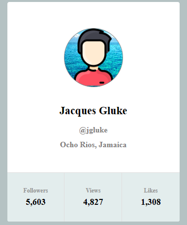
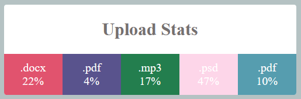
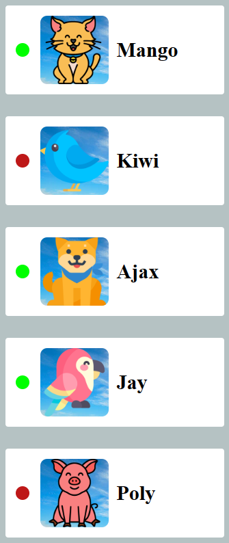
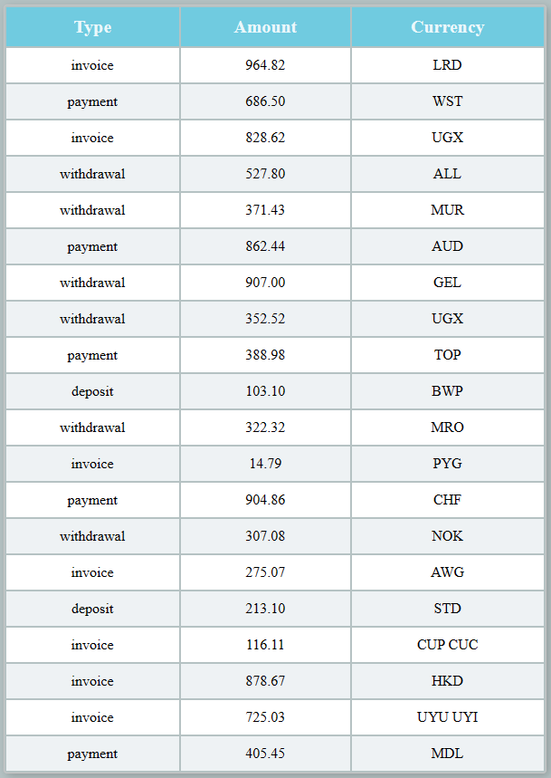

# Components 

https://viache-slav.github.io/goit-react-hw-01-components/ - link to the working page in github

This project was created as a first homework assignment with react.js from the GOIT school 

Project consists of four tasks, the purpose of which is to test the student's knowledge of how to display different data sets on a browser page. 

To run the project on your hardware: 
   -you need to clone this repository https://github.com/Viache-Slav/goit-react-hw-01-components.git.
   -run the installation with the command `npm install`
   -start the project with the command `npm start`

## screenshot of the first task 

## screenshot of the second task 

## screenshot of the third task 

## screenshot of the fourth task 
